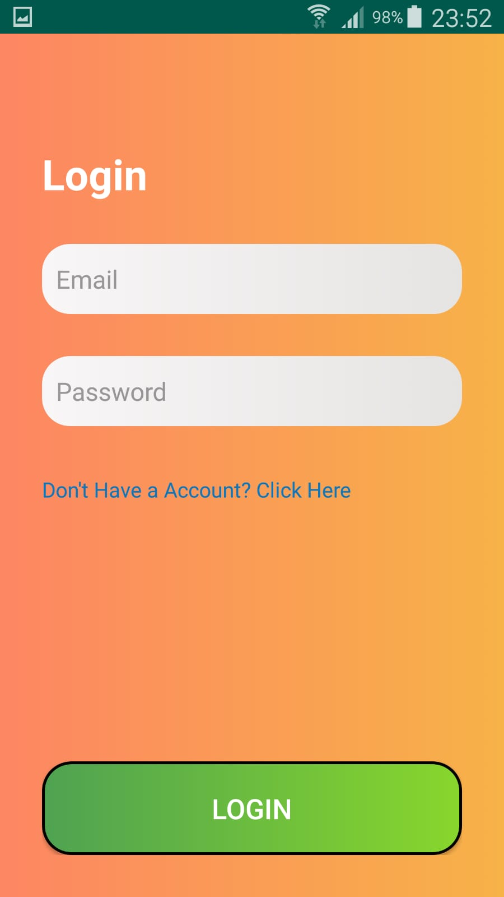
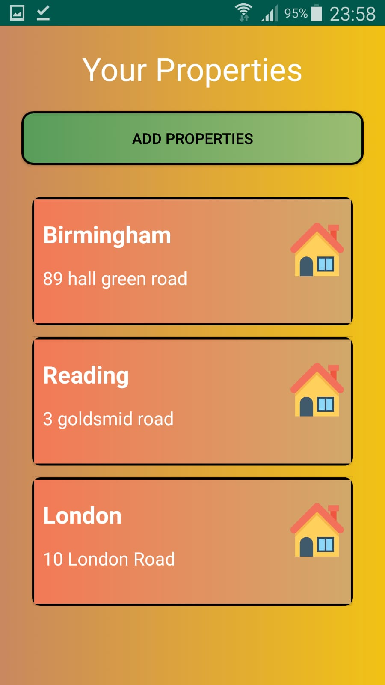
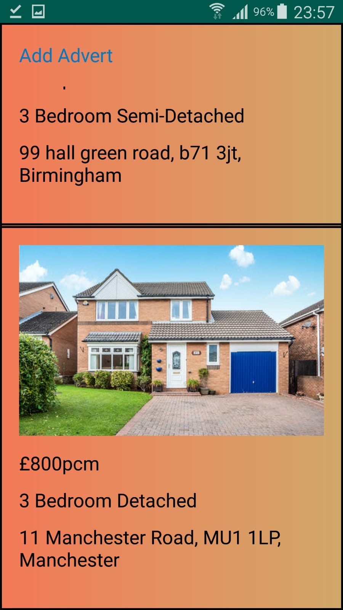
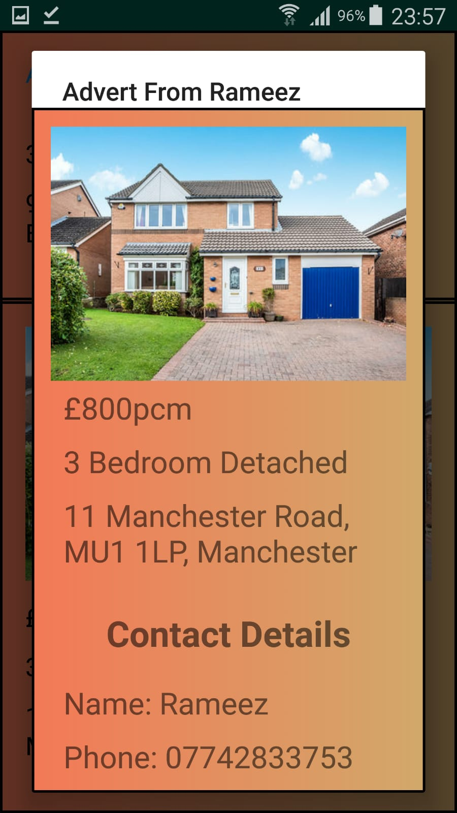

# Landlord Base
- Android Studio
- New Version of Property Management Android Application
- Built Using Java
- Firebase for Database and User Login and Registeration
- Updated Final Year Project, Adding New Features such as Report Generator
- Rent2Rent Ad Posting Feature implemented
- MVC Design Pattern used

# About
Landlord Base is a property management application that allows users to be able to add, modify and delete property data as well as generate reports for each property. The property advertisement feature allows users to post and view property advertisements.

# Firebase Usage
Ensure you have a Firebase account and proceed to add your own **google services** file into the **app** folder in your Android Studio project, with out this Firebase will not be able to do login authentication.

- All Firebase dependencies must be the same version.

# Screenshots of Application

 

 
